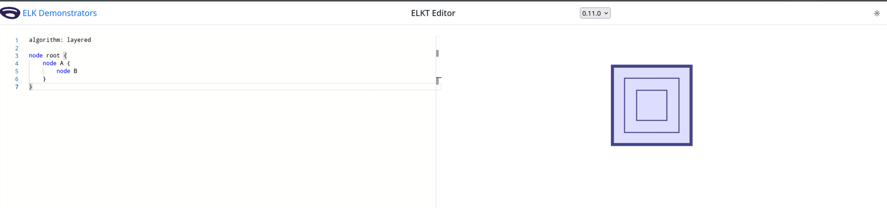

# Readme 

This repository reproduces a nullpointer exception that occurs when subgraphs use MODEL_ORDER. I was trying to layout a graph 
in another project that uses MODEL ORDER to determine the order that nodes appear in and encountered this issue. 

```kotlin
fun setElkContainerNodeProperties(elkNode: ElkNode) {
    elkNode.setProperty(CoreOptions.ALGORITHM, "org.eclipse.elk.layered")
    // Setting either of CONSIDER_MODEL_ORDER_STRATEGY or CYCLE_BREAKING_STRATEGY triggers the exception codepath
    elkNode.setProperty(LayeredOptions.CONSIDER_MODEL_ORDER_STRATEGY, OrderingStrategy.PREFER_NODES)
    elkNode.setProperty(LayeredOptions.CYCLE_BREAKING_STRATEGY, CycleBreakingStrategy.MODEL_ORDER)
    elkNode.setProperty(CoreOptions.HIERARCHY_HANDLING, HierarchyHandling.INCLUDE_CHILDREN)
}

fun main() {
    LayoutMetaDataService.getInstance().registerLayoutMetaDataProviders(LayeredMetaDataProvider())

    val elkGraphRoot: ElkNode = ElkGraphUtil.createGraph()
    val nodeA = ElkGraphUtil.createNode(elkGraphRoot)
    val nodeB = ElkGraphUtil.createNode(nodeA)

    setElkContainerNodeProperties(elkGraphRoot)
    setElkContainerNodeProperties(nodeA)

    RecursiveGraphLayoutEngine().layout(elkGraphRoot, BasicProgressMonitor())
}
```
This triggers the nullpointer exception. 

The graph should look like this: 


## Description 

The combination of setting HIERARCHY_HANDLING to INCLUDE_CHILDREN and CYCLE_BREAKING_STRATEGY to MODEL_ORDER results in 
a nullpointer exception because the code tries to get the MAX_MODEL_ORDER_NODES in the subgraph. However, 
MAX_MODEL_ORDER_NODES is calculated in importHierarchicalGraph and only sets it for the root graph. 

```java
public void process(final LGraph layeredGraph, final IElkProgressMonitor monitor) {
    monitor.begin("Model order cycle breaking", 1);

    // gather edges that point to the wrong direction
    List<LEdge> revEdges = Lists.newArrayList();

    // One needs an offset to make sure that the model order of nodes with port constraints is
    // always lower/higher than that of other nodes.
    // E.g. A node with the LAST constraint needs to have a model order m = modelOrder + offset
    // such that m > m(n) with m(n) being the model order of a normal node n (without constraints).
    // Such that the highest model order has to be used as an offset
    int offset = Math.max(layeredGraph.getLayerlessNodes().size(), layeredGraph.getProperty(InternalProperties.MAX_MODEL_ORDER_NODES));
    int bigOffset = offset * layeredGraph.getProperty(InternalProperties.CB_NUM_MODEL_ORDER_GROUPS);
```
`ModelOrderCycleBreaker.java:65` tries to access MAX_MODEL_ORDER_NODES. 

```java
private void importHierarchicalGraph(final ElkNode elkgraph, final LGraph lgraph) {
    ...
    // Save the maximum node model order.
    // This is relevant to create graph partitions based on model order and constraints.
    lgraph.setProperty(InternalProperties.MAX_MODEL_ORDER_NODES, index);
    // Save the number of model order groups.
    lgraph.setProperty(InternalProperties.CB_NUM_MODEL_ORDER_GROUPS, cbGroupModelOrders.size());

    // Model order index for edges. 
    index = 0;
    // Transform the edges
    elkGraphQueue.add(elkgraph);
    ...
}
```
`ElkGraphImporter.java:377` sets the MAX_MODEL_ORDER_NODES but it only sets it for the root graph.

```java
public final class LayeredLayoutProvider extends AbstractLayoutProvider implements IWhiteBoxTestable {
    ...
    @Override
    public void layout(final ElkNode elkgraph, final IElkProgressMonitor progressMonitor) {
        // Import the graph (layeredGraph won't be null since the ElkGraphTransformer always returns an LGraph
        // instance, even though the IGraphTransformer interface would allow null as a return value)
        IGraphTransformer<ElkNode> graphTransformer = new ElkGraphTransformer();
        LGraph layeredGraph = graphTransformer.importGraph(elkgraph);

        // Check if hierarchy handling for a compound graph is requested
        if (elkgraph.getProperty(LayeredOptions.HIERARCHY_HANDLING) == HierarchyHandling.INCLUDE_CHILDREN) {
            // Layout for all hierarchy levels is requested
            elkLayered.doCompoundLayout(layeredGraph, progressMonitor);
        } else {
            // Only the top-level graph is processed
            elkLayered.doLayout(layeredGraph, progressMonitor);
        }
        
        if (!progressMonitor.isCanceled()) {
            // Apply the layout results to the original graph
            graphTransformer.applyLayout(layeredGraph);
        }
    }
    ...
```
`LayeredLayoutProvider.java` calls the importGraph which creates the internal LGraph. Than the doCompoundLayout crashes. 

```java
private void hierarchicalLayout(final LGraph lgraph, final IElkProgressMonitor monitor) {
    // Perform a reversed breadth first search: The graphs in the lowest hierarchy come first.
    Collection<LGraph> graphs = collectAllGraphsBottomUp(lgraph);

    // We have to make sure that hierarchical processors don't break the control flow 
    //  of the following layout execution (see e.g. #228). To be precise, if the root node of 
    //  the hierarchical graph doesn't include a hierarchical processor, nor may any of the children.
    reviewAndCorrectHierarchicalProcessors(lgraph, graphs);

    // Get list of processors for each graph, since they can be different.
    // Iterators are used, so that processing of a graph can be paused and continued easily.
    int work = 0;
    List<Pair<LGraph, Iterator<ILayoutProcessor<LGraph>>>> graphsAndAlgorithms = new ArrayList<>();
    for (LGraph g : graphs) {
        graphConfigurator.prepareGraphForLayout(g);
        List<ILayoutProcessor<LGraph>> processors = g.getProperty(InternalProperties.PROCESSORS);
        work += processors.size();
        Iterator<ILayoutProcessor<LGraph>> algorithm = processors.iterator();
        graphsAndAlgorithms.add(Pair.of(g, algorithm));
    }

    monitor.begin("Recursive hierarchical layout", work);

    // When the root graph has finished layout, the layout is complete.
    int slotIndex = 0;
    Iterator<ILayoutProcessor<LGraph>> rootProcessors = getProcessorsForRootGraph(graphsAndAlgorithms);
    while (rootProcessors.hasNext()) {
        // Layout from bottom up
        for (Pair<LGraph, Iterator<ILayoutProcessor<LGraph>>> graphAndAlgorithm : graphsAndAlgorithms) {
            Iterator<ILayoutProcessor<LGraph>> processors = graphAndAlgorithm.getSecond();
            LGraph graph = graphAndAlgorithm.getFirst();

            while (processors.hasNext()) {
                ILayoutProcessor<LGraph> processor = processors.next();
                if (!(processor instanceof IHierarchyAwareLayoutProcessor)) {
                    // Output debug graph
                    // elkjs-exclude-start
                    if (monitor.isLoggingEnabled()) {
                        DebugUtil.logDebugGraph(monitor, graph, slotIndex,
                                "Before " + processor.getClass().getSimpleName());
                    }
                    // elkjs-exclude-end

                    notifyProcessorReady(graph, processor);
                    processor.process(graph, monitor.subTask(1));
                    notifyProcessorFinished(graph, processor);
```
`ElkLayered.java:209` code most clearly shows the subgraph not having MAX_MODEL_ORDER_NODES set. The subgraphs are collected from 
`collectAllGraphsBottomUp(lgraph)` and if you breakpoint in `graphsAndAlgorithms.add(Pair.of(g, algorithm));` and check g with 
`g.getProperty(InternalProperties.MAX_MODEL_ORDER_NODES)` it shows as null. When the subgraph without MAX_MODEL_ORDER_NODES set
is passed into `processor.process(graph, monitor.subTask(1))` the code tries to read MAX_MODEL_ORDER_NODES. 

I'm still not entirely clear on why process needs MAX_MODEL_ORDER_NODES. 